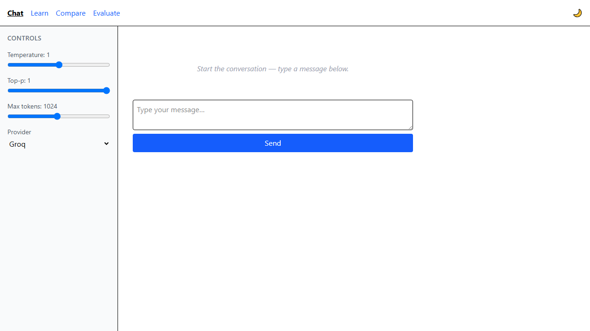
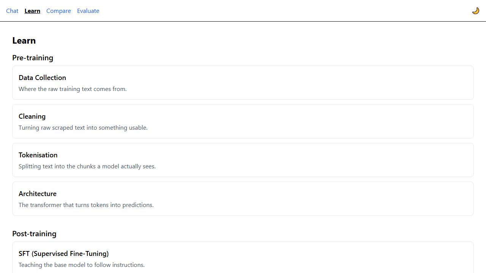
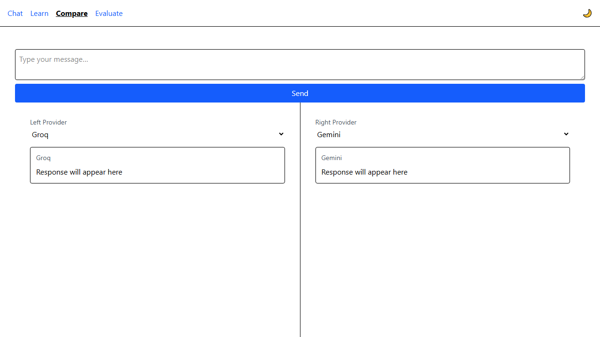
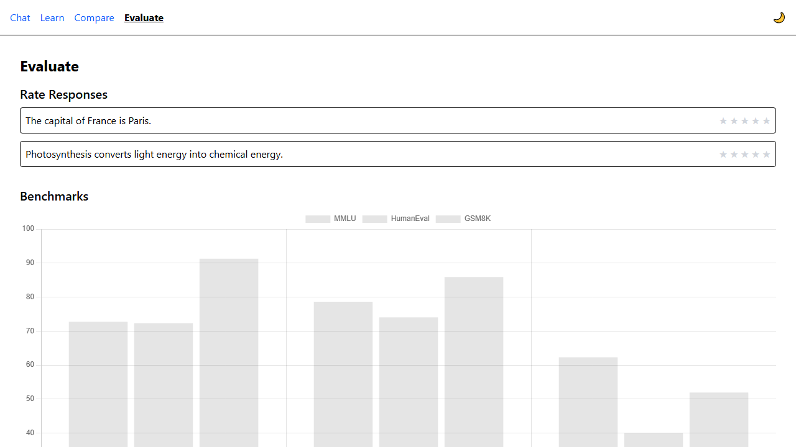

# LLM Playground

A free, browser-only playground for talking to and learning about large language models. Type a
message and chat with **Groq**, **Gemini**, or **OpenRouter** (all free tiers, no server, no paid
APIs), tune generation behavior with temperature / top-p / max-tokens sliders, watch the
**tokeniser demo** split any text into coloured token chips in real time, **compare** two models
side by side on the same prompt, **rate** responses with a star widget, and read plain-English
**Learn** cards on how LLMs are pre-trained, post-trained, evaluated, and how text generation
actually works. The whole thing runs entirely in your browser — there is no backend server.

**Live demo:** https://llm-playground-two.vercel.app
*(No API keys are configured on the deployed instance — the UI is fully browsable, but sending a
chat message will show the existing "No API key found" error. Follow the steps below to run it
locally with your own free keys and a working AI backend.)*

## Screenshots

| Chat | Learn |
|------|-------|
|  |  |

| Compare | Evaluate |
|---------|----------|
|  |  |

## How to run locally

```bash
git clone https://github.com/aryansingh975/LLM-Playground.git
cd LLM-Playground
npm install
npm run dev
```

This starts the Vite dev server (with hot reload) at `http://localhost:5173`. Other useful scripts:

```bash
npm run build   # production build to dist/
npm run test    # run the Vitest suite
npm run lint    # run oxlint
```

## How to get free API keys

The app talks to three free LLM providers. You only need one to start chatting, but all three unlock
the model-comparison feature. Copy `.env.example` to `.env.local` and fill in whichever keys you get:

| Provider | Sign up | `.env.local` variable |
|----------|---------|------------------------|
| Groq | [console.groq.com](https://console.groq.com) | `VITE_GROQ_API_KEY` |
| Gemini | [aistudio.google.com](https://aistudio.google.com) | `VITE_GEMINI_API_KEY` |
| OpenRouter | [openrouter.ai](https://openrouter.ai) | `VITE_OPENROUTER_API_KEY` |

```bash
cp .env.example .env.local
# then paste your key(s) into .env.local
```

`.env.local` is gitignored and never committed. If a key is missing, the app shows a friendly
"No API key found" message instead of crashing — see
[`specs/spec-S2.3-error-handling/spec.md`](specs/spec-S2.3-error-handling/spec.md).

## Architecture

There's no backend server — the browser calls the AI providers' APIs directly. See
[`docs/architecture.md`](docs/architecture.md) for the full data-flow diagram, where API keys live,
and what each route does.

## Tech stack

React + Vite, Tailwind CSS, React Router, Chart.js, `gpt-tokenizer`, Vitest — no backend, no
database, deployed as a static site on Vercel. Built spec-by-spec; see [`roadmap.md`](roadmap.md)
and [`specs/`](specs/) for the full build history.
